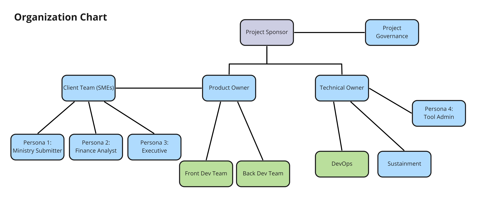

# citz-dst-capstone-2021

CITZ-DST Reporting and Dashboard System Improvement Application

## Introduction

OCIO-DIO is the BC Governments central Digital Investment Branch within the Office of the CIO. The DIOs mandate includes:

- Engaging with Ministry Business Units to support their IM/IT project initiatives
- Providing executives with an a Whole of Government view of strategic IM/IT initiatives including fiscal, project-related and sustainment efforts in support of the Government IM/IT portfolio
- Providing a project repository for DIO financial analysts
- Reporting to the Government Chief Digital Officer (CDO)

To support DIOs tracking of strategic IM/IT initiatives , a modern web enabled Digital Investment Report and Analysis tool is required that will aid Ministry Business Units in their new application development journeys. To support the DIO tool the Capstone2021 Web Application is being developed to demonstrate a forms based approach to data acquisition.

## Problem Statement

The OCIO-DIO manages capital funding for projects that aim to improve digital services for British Columbians. Ministries that are awarded funding must report their project performance to the DIO quarterly.

Reports are filled out and submitted manually through the use of spreadsheets. This method is time consuming and can result in data inconsistencies that become a barrier to timely and quality data analysis.

## Hypothesis

Developing a web application to support stakeholders in the quarterly reporting process will assist in improving workflows and data quality.

Utilizing a digital form to capture data from submitters can facilitate effective and efficient reporting through the use of pre-filled fields and form validation. 

Opportunities for automating data aggregation can be acted upon through the use of a database to store reporting data. Furthermore, stored data can then be surfaced into a dashboard system to help ensure decision makers and other stakeholders have access to the information they need when they need it.

## Goal

The goal of the Capstone 2021 project team is to create a modern web application as a tool for the DIO to use to replace spreadsheets as the primary project reporting method.

Objectives include:

- Apply modern application development methodology based on AGILE principles
- Create a modern web application that is intuitive and easy to use
- Store project and reporting information in a central repository such as a database
- Host the solution in the BC Dev Exchange's container environment

## Project Status

2021 Camosun Capstone Project Complete

## Development

Node.js | React.js | OpenShift 4 | Jenkins | MongoDB | GitHub

## Documentation

- [X] Introduction
    - [X] [Business Problem](https://github.com/bcgov/citz-dst-capstone-2021/wiki)
- [X] People
	- **Project Sponsor:** BC Government OCIO - Digital Investment Office
	- **Roles:**
        + **Product Owner:** Shashank Shekhar
        + **Project Stakeholders:** Ministry Submitters, Finance Analysts, Executives/Decision Makers, Site Admin/Tool Admin
        + **Front Dev Team:** Samara Flueck & Sunghwan Park
        + **Back Dev Team:** Sunghwan Park
        + **Dev Ops:** Poornima Sivanand & Sunghwan Park
        
- [X] [Requirements](https://github.com/bcgov/citz-dst-capstone-2021/blob/main/app/docs/projectPortfolio/reportsSubmitted/Team%20RDSI%20-%20Products%20Requirement%20Document.pdf)
- [X] Design & Architecture
	- [X] [Interviews](https://github.com/bcgov/citz-dst-capstone-2021/wiki/User-Research#interview-notes)
    - [X] [Personas](https://github.com/bcgov/citz-dst-capstone-2021/wiki/User-Research#personas)
    - [x] [Journeys](https://github.com/bcgov/citz-dst-capstone-2021/wiki/User-Journeys#finance-analyst-reviews-single-report)
    - [X] [Wireframes](https://github.com/bcgov/citz-dst-capstone-2021/wiki/Wireframes)
    - [X] [Security](https://github.com/bcgov/citz-dst-capstone-2021/blob/main/app/docs/diagrams/actions-vs-roles-diagram.jpg?raw=true)
    - [X] [Data Model](https://dbdiagram.io/d/60d132d20c1ff875fcd5d83b)
    - [X] [Architectural Decision Log](https://github.com/bcgov/citz-dst-capstone-2021/wiki/Architectural-Decision-Log)
- [X] [User Processes](https://github.com/bcgov/citz-dst-capstone-2021/wiki/User-Processes)
- [X] Solution Architecture
	- [X] [Diagram](https://github.com/bcgov/citz-dst-capstone-2021/blob/main/app/docs/diagrams/solution-architecture.jpg?raw=true)
    - [X] [Front-end Dependencies](./app/client/package-lock.json)
    - [X] [API Server Dependencies](./app/server/package-lock.json)
    - [X] [APIs](https://rdsi-server.adccd1-prod.apps.silver.devops.gov.bc.ca/api-docs/)
    - [X] [Installation](https://github.com/bcgov/citz-dst-capstone-2021/wiki/How-to-install-RDSI)
    - [X] [Deployment](https://github.com/bcgov/citz-dst-capstone-2021/wiki/Deployment-Process)
    - [X] [MongoDB Backup and Restore](https://github.com/bcgov/citz-dst-capstone-2021/wiki/RDSI-Database-on-MongoDB)
    - [X] [Style Guides](./app/docs/style-guides.md)
- [X] [Project Portfolio](https://github.com/bcgov/citz-dst-capstone-2021/tree/main/app/docs/projectPortfolio)
- [X] [Recommendations/Lessons Learned](https://github.com/bcgov/citz-dst-capstone-2021/wiki/Limitations-and-Recommendations)

## License

```
Copyright 2021 Province of British Columbia

Licensed under the Apache License, Version 2.0 (the "License");
you may not use this file except in compliance with the License.
You may obtain a copy of the License at

   http://www.apache.org/licenses/LICENSE-2.0

Unless required by applicable law or agreed to in writing, software
distributed under the License is distributed on an "AS IS" BASIS,
WITHOUT WARRANTIES OR CONDITIONS OF ANY KIND, either express or implied.
See the License for the specific language governing permissions and
limitations under the License.
```

## Lifecycle

[](https://github.com/bcgov/citz-dst-capstone-2021)

