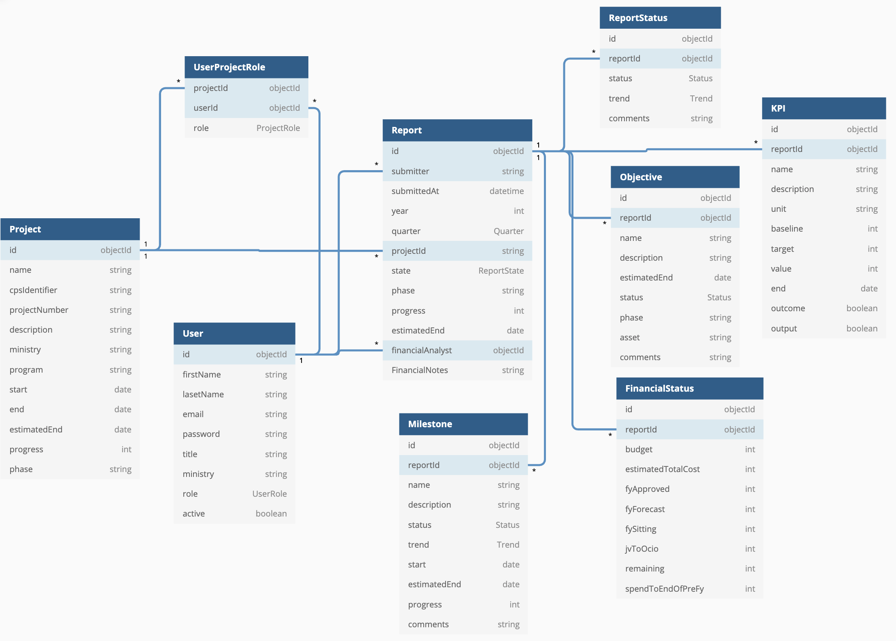

# RDSI Database on MongoDB

## Deploy MongoDB Pod

If the database pod has not been deployed yet, refer to [Deploy MongoDB](./deployment.md#Deploy MongoDB)

## Data Models

### Document Structures

Database RDSI has three main collections, users, projects, and reports. Report document has four sub-documents(objective, milestone, kpi and status) and one nested document, finance.

```
rdsi
├── users
├── projects
└── reports
    ├── objectives
    ├── milestones
    ├── kpis
    ├── status
    └── finance
```

The relations of the documents could be represented like the following diagram if you are using a RDBMS.

Documents and sub-documents have `id`(_id), `createdAt`, and `updatedAt` including fields in the following diagram.

[RDSI Schema](https://dbdiagram.io/d/60d132d20c1ff875fcd5d83b)



> :warning: UserProjectRole table is not implemented.

## Back up & Restore Instructions

This section explains how to dump and restore mongodb data. The database port 27017 and any service route to the port are not open to the Internet. Therefore, you need to log into the database pod using `oc rsh` to run `mongodump` and `mongorestore`.

### Back up data using mongodump

If you are not familiar to Openshift CLI, then refer to [Getting started with the Openshift CLI](https://docs.openshift.com/container-platform/4.2/cli_reference/openshift_cli/getting-started-cli.html).

#### Get the pod name of MongoDB

First, you need to get the pod name to back up.

```
$ oc get pods -l name=mongodb -o name
pod/mongodb-2-8rnjx
```

#### Connect to the pod and run mongodump

Connect to the pod

`$ oc rsh mongodb-2-8rnjx`

Run `mongodump` command using MONGODB_USER and `rdsi` database options.

> All environment variables have been defined when we deployed the pod.

```
sh-4.2$ mongodump -h $MONGODB_SERVICE_HOST:$MONGODB_SERVICE_PORT -d rdsi -u $MONGODB_USER -p $MONGODB_PASSWORD
```

Compress dump files

```
sh-4.2$ tar czf `date "+%Y-%m-%d_%H-%M-%S"`.tar.gz dump
```

If you want to include `admin` database containing mongodb users and authentication information, run `mongodump` with `admin` user and without database option `-d rdsi`.

`mongorestore -h $MONGODB_SERVICE_HOST:$MONGODB_SERVICE_PORT -u admin -p $MONGODB_ADMIN_PASSWORD`

#### Download dump files

If you do not use PV(Persistent Volume), any data in the pod will be gone if you redeploy the pod. Therefore, you need to copy the backup file to the local machine.

`$ oc rsync mongodb-2-8rnjx:/opt/app-root/src/2021-07-30_04-40-23.tar.gz .`

### Restore data using mongorestore

The restore process is reverse to the backup process.

#### Copy a backup file to the pod

`$ oc rsync . mongodb-2-8rnjx:/opt/app-root/src/ --exclude="*" --include=2021-07-30_04-40-23.tar.gz --no-perms`

#### Extract and confirm files

```
2021-07-30_04-40-23.tar.gz
sh-4.2$ tar xf 2021-07-30_04-40-23.tar.gz
sh-4.2$ ls dump/
rdsi
```

#### Restore data from a backup file

If the database already exists, then `mongorestore` command without `--drop` option might fail.

```
sh-4.2$ mongorestore -h $MONGODB_SERVICE_HOST:$MONGODB_SERVICE_PORT -d rdsi -u $MONGODB_USER -p $MONGODB_PASSWORD dump/rdsi --drop
...
2021-07-30T05:00:07.996+0000	finished restoring rdsi.users (14 documents)
2021-07-30T05:00:07.996+0000	done
```

If you created the backup file using `admin` user and want to restore `admin` database too, then use the following command.

`mongorestore -h $MONGODB_SERVICE_HOST:$MONGODB_SERVICE_PORT -u admin -p $MONGODB_ADMIN_PASSWORD --drop dump`

## Limitations & Considerations