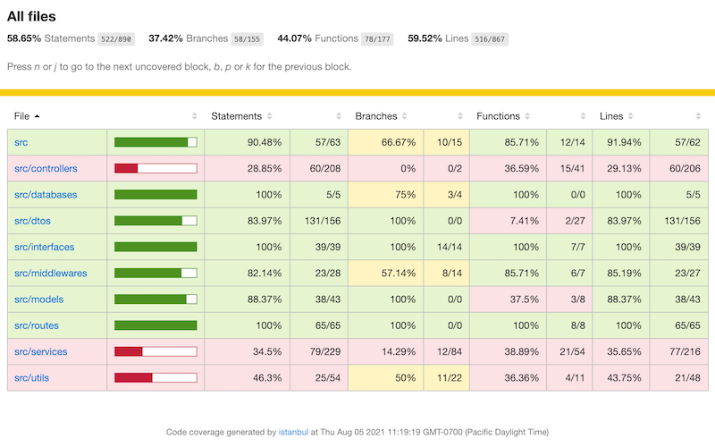

# Limitations and Recommendations

## Database

### Relation of user and project

- AS-IS
  - A project has three user fields to the roles of manager, sponsor, financial analyst.
  - A project cannot have more than one user per role.
  - A new role in a project requires a new field.

- TO-BE
  - Define an associative table to map users and projects

### Ministry list

- AS-IS
  - Ministry list is a hard-coded list of strings in the source code

- TO-BO
  - Add the ministries table or
  - Use [BC Data Catalogue API](https://catalogue.data.gov.bc.ca/he/dataset/bc-data-catalogue-api)

## CI/CD

### MongoDB deployment

- AS-IS
  - Manual deployment and backup
  - No high availability
  - The template's latest MongoDB version is 3.6, which does not support a transaction. See [Use Transaction](#use-transaction).

- TO-BE
  - Option 1: Openshift
    - Check if [MongoDB Ops Manager](https://www.mongodb.com/products/ops-manager) is available in the Openshift cluster
    - Use images of MongoDB version 4.2 or later
    - Define a deployment configuration
    - Define StatefulSet with PVC(persistent volume claim)
    - Configure Replica Sets for HA
    - Automate backup
  - Option 2: [MongoDB Cloud](https://www.mongodb.com/cloud/atlas)

## Backend API project

### Swagger definitions

#### Add descriptive comments and summaries

- AS-IS
  - Insufficient descriptions or comments for beginners

- TO-BE
  - Update summaries and comments to be self-descriptive
  - Add examples for complex queries having many options

#### Add endpoints to query FA's report summary

- AS-IS
  - FA's dashboard executes four queries
  - Queries return the whole report data

- TO-BE
  - Define a view for the summary page
  - Add an endpoint to return numbers of reports for each state

### Use transaction

- AS-IS
  - Database is designed to reduce relations between documents.
  - Code points requiring a transaction.
    - New project creation inserts a project and the initial report.
    - Report submission submits a report and generates the next report
  - If an error occurs during a transaction, it can cause data inconsistency.

- TO-BE
  - Prerequisite - MongoDB version 4.2 or later. See [MongoDB deployment](#mongodb-deployment)
  - Use [MongoDB Transactions](https://docs.mongodb.com/manual/core/transactions/#transactions-api) for multiple update queries

### Soft delete

- AS-IS
  - Delete queries execute `Model.findByIdAndDelete` and eventually delete data permanently.

- TO-BE
  - Option 1: Use [Mongoose Delete Plugin](https://www.npmjs.com/package/mongoose-delete)
  - Option 2: Implement `soft delete`

### Pagination

- AS-IS
  - `GET` queries might return too big data if there are many projects and reports

- TO-BE
  - Option 1: Implement pagination.
    > Reference: [The right way to make advanced and efficient MongoDB pagination](https://dev.to/max_vynohradov/the-right-way-to-make-advanced-and-efficient-mongodb-pagination-16oa)
  - Option2: Use [mongoose-paginate-v2](https://www.npmjs.com/package/mongoose-paginate-v2)
  - Pagination should be implemented on the frontend side too. See [Table Pagenation](#table-pagination)

### Search

See [Search projects and reports](#search-projects-and-reports)

### Project query parameters

- AS-IS
  - `GET` query for projects has no parameters.

- TO-BE
  - Add parameters to project query as `report query`.

### Logging

- AS-IS
  - No logging requirements
  - Log format - 

### Keycloak and BC Gov Directory integration

- [Default Realm Settings](https://github.com/BCDevOps/keycloak-admin/wiki/Default-Realm-Settings)

### Set CORS origin

- AS-IS
  - origin is defined as `*`.

- TO-BE
  - Define the final production URL to `apiUrl` in `app/server/config/production.json`.

### Enable Helmet `Content Security Policy`

If it is enabled, it causes the following error on the client-side.

> Refused to execute inline script because it violates the following Content Security Policy directive

### History

- AS-IS
  - No record has history, and the last updated data is displayed.

- TO-BE
  - It could be a big change affecting many update queries.
  - Define which models and fields need to have history.
  - Define a view displaying history.

## Frontend React project

### Financial analyst dashboard - Quarterly Report Summary

- AS-IS
  - Not implemented

- TO-BE
  - Implement [Quarterly report summary wireframe](./images/wf_quarterly_report_summay.png)

### Role-based access control

- AS-IS
  - No RBAC
  - Partially masking menu by the user information

- TO-BE
  - Use [CASL](https://github.com/stalniy/casl).
  - Decide if RBAC should be implemented on the backend.

### Improve new project form

- AS-IS
  - One component handles multiple forms and steps

- TO-BE
  - Convert each step to a separate component
  - Allow navigating steps by stepper icons
  - Use the event emitter instead of passing handlers as props

### Component granularity

- AS-IS
  - In the tight time-frames, we started to implement partial wireframes without designing components.

- TO-BE
  - Follow the standard process to identify components.
    1. Identify components from wireframes.
    2. Identify reusable components.
    3. Identify common styles.
  - Convert functions returning a React Element to a component.
  - Consider using [Storybook](https://storybook.js.org/docs/react/get-started/introduction).

### Style consistency

- AS-IS
  - See [Component granularity](#component-granularity).
  - Use theme borrowed from [platform-service-registry](https://github.com/bcgov/platform-services-registry).
  - [RDSI Theme](../client/src/components/Theme.tsx) is defined, but rarely used.

- TO-BE 
  - Use material-ui style if possible.
  - Replace [theme](../client/src/theme.ts) with [RDSI Theme](../client/src/components/Theme.tsx).
  - Move the style of styled components to the theme if it is reusable.
  - Use [ThemeProvider](https://material-ui.com/customization/theming/)

### Use Context API

- AS-IS
  - connect a store state `user` to several components

- TO-BE
  - Use context API to pass `user` to child components

### Form presentation

- AS-IS
  - New project and submit report forms have multiple steps and sub-forms.
  - Forms got complex while validating multiple steps and sub-forms.

- TO-BE
  - Discuss how to split the current multi-step forms
  - The project details view could be an example allowing to edit partially

### Reporting period

- AS-IS
  - Each project in the submitters' project list table has a due date.
  - The reporting period could be applied to all reports. Therefore, it has no meaning that each report has duplicate due dates.

- TO-BE
  - Use a global notification method like a notification bar in the header so that every user could be notified that the period or due date is approaching. 

### Restrict submission

- AS-IS
  - You can submit a report at any time.

- TO-BE
  - Define [Reporting Period](#reporting-period).
  - Define bumper periods before and after the reporting period.
  - Restrict submissions out of the bumper periods.

### KPI Unit prepending option

- AS-IS
  - `$` is prepended, and other units are appended

- TO-BE
  - Add a field to set it to be prepended

### Issues in the FA review panel

- AS-IS
  - No new issue input form
  - No issues table

- TO-BE
  - Define issue data model and APIs
  - Add new issue form
  - Add issue list table

### Enhanced Query

- AS-IS
  - Query APIs are not designed from the analysis of data requirements in the screens.
  - Overall, each screen fetches excessive data.

- TO-BE
  - Filter projects and reports that a user has a role for it.
  - Summarize each screen's data requirements.
  - Filter unused fields out from the results.

### Validation of financial information form

- AS-IS
  - The total budget and estimated cost should be greater than 0.

- TO-BE
  - Define the precision number of currency values
  - Define the `min` and `max` values for each field.
  - Define restrictions caused by relations to other fields

### Table Pagination

- AS-IS
  - Every table has no limit for their items.

- TO-BE
  - Use [material-table](https://github.com/mbrn/material-table).
  - Add an input field to define the number of items per page.

### Search projects and reports

- AS-IS 
  - No search function

- TO-BE
  - Define target data field to search.
  - Add a search input field to every query that its result is displayed as a table.
  - Use [material-table](https://github.com/mbrn/material-table).

### Table filtering and sorting

- AS-IS
  - No table sort

- TO-BE
  - Define columns to filter
    - Ministry, Reporting Period, Report Status
  - Define columns to sort
  - Use [material-table](https://github.com/mbrn/material-table).

### Persistent session on reloading a window

- AS-IS
  - You lose the login token and have to log in again if you reload or refresh the window

- TO-BE
  - Research if [keycloak integration](#keycloak-and-bc-gov-directory-integration) could resolve this issue.
  - Otherwise, use a cookie or store a token in the browser's local storage.

### Refresh token
- AS-IS
  - A token expires in the expiration time, and the default is 600 seconds.
  - The expiration time is not extended, and users need to log in again.

- TO-BE
  - Users should not be interrupted by frequent token expirations.
  - Consider using [Refresh Token](https://auth0.com/blog/refresh-tokens-what-are-they-and-when-to-use-them/)

### Project completion process

- AS-IS
  - No definition for project completion.

- TO-BE
  - Define the policy to set a project to be complete
  - Display state of completion
  - Disable submission and generation of the next report
  - Discuss if a project could be suspended, dropped, or terminated without completion or resume.

### Enable `no-console` and `no-alert` rules

- AS-IS
  - ESLint disallows `console.log` and `alert` functions by default.
  - Some incomplete screens use them to mark the cases properly and remove alerts and console logs

### Issues to be fixed

These warnings and errors are printed on the browser's console view, although they do not affect functionalities. 

- [findDOMNode is deprecated in StrictMode](https://stackoverflow.com/questions/61220424/material-ui-drawer-finddomnode-is-deprecated-in-strictmode)

    - Location: Dropdown list popup, review-report -> details expansion 

    > index.js:1 Warning: findDOMNode is deprecated in StrictMode. findDOMNode was passed an instance of Transition which is inside StrictMode. Instead, add a ref directly to the element you want to reference. Learn more about using refs safely here: https://reactjs.org/link/strict-mode-find-node

- The pseudo class ":first-child" is potentially unsafe

    - Location: Home
  
    > The pseudo class ":first-child" is potentially unsafe when doing server-side rendering. Try changing it to ":first-of-type".

 
- Cannot update during an existing state transition

    - Location: Project list page, finance-analyst-dashboard
  
    > Warning: Cannot update during an existing state transition (such as within `render`). Render methods should be a pure function of props and state.

- Failed prop type: Invalid prop `children` supplied to `ForwardRef(Modal)`

    - Location: New project form

    > index.js:1 Warning: Failed prop type: Invalid prop `children` supplied to `ForwardRef(Modal)`. Expected an element that can hold a ref. Did you accidentally use a plain function component for an element instead? For more information see https://material-ui.com/r/caveat-with-refs-guide

- Function components cannot be given refs

    - Location: New milestone / objective / kpi form

    > Warning: Function components cannot be given refs. Attempts to access this ref will fail. Did you mean to use React.forwardRef()

- Warning: Each child in a list should have a unique "key" prop.
  - Location: Project details, report details, report details -> financial information

- Invalid DOM nesting
  
  - Location: Project details
  
  > `Warning: validateDOMNesting(...): <h5> cannot appear as a descendant of 
.`
 
  > `Warning: validateDOMNesting(...): 
 cannot appear as a descendant of 
.`

  > `validateDOMNesting(...): <h6> cannot appear as a descendant of 
`.

  > `Warning: validateDOMNesting(...): 
 cannot appear as a descendant of 
`
  
  - Location: Project details > milestones

  > `Warning: validateDOMNesting(...): <ul> cannot appear as a descendant of 
.`
  
  - Location: Project details > milestones

  > `Warning: validateDOMNesting(...): <th> cannot appear as a child of <thead>`
  
  - Location: Project details > reports list

  > `Warning: validateDOMNesting(...): <table> cannot appear as a descendant of 
.`
 

- React does not recognize the `hidePercent` prop
  
  - Location: Project details

  > Warning: React does not recognize the `hidePercent` prop on a DOM element. If you intentionally want it to appear in the DOM as a custom attribute, spell it as lowercase `hidepercent` instead. If you accidentally passed it from a parent component, remove it from the DOM element.

- Can't perform a React state update on an unmounted component

  - Location: Edit report > Financial information

  > Warning: Can't perform a React state update on an unmounted component. This is a no-op, but it indicates a memory leak in your application. To fix, cancel all subscriptions and asynchronous tasks in a useEffect cleanup function.

## Testing

- AS-IS
  - The API test cases depend on the actual database connections
  - No unit tests on the frontend
  - No e2e tests
  - APIs test coverage

    

- TO-BE
  - Use jest mock functions instead of database connections.
  - Improve the coverage rate.
  - Implement unit tests on the frontend. 
  - Implement e2e tests
