# User Processes

This document describes the processes or use cases that users engage in when interacting with our POC prototype application.

### Login Process

**Who:** All User Personas
**When:** A registered user is not currently logged into the application.

When a user first comes to the application they are presented with a landing page that describes the project goals, application roles, and a link to an about view describing the project further.

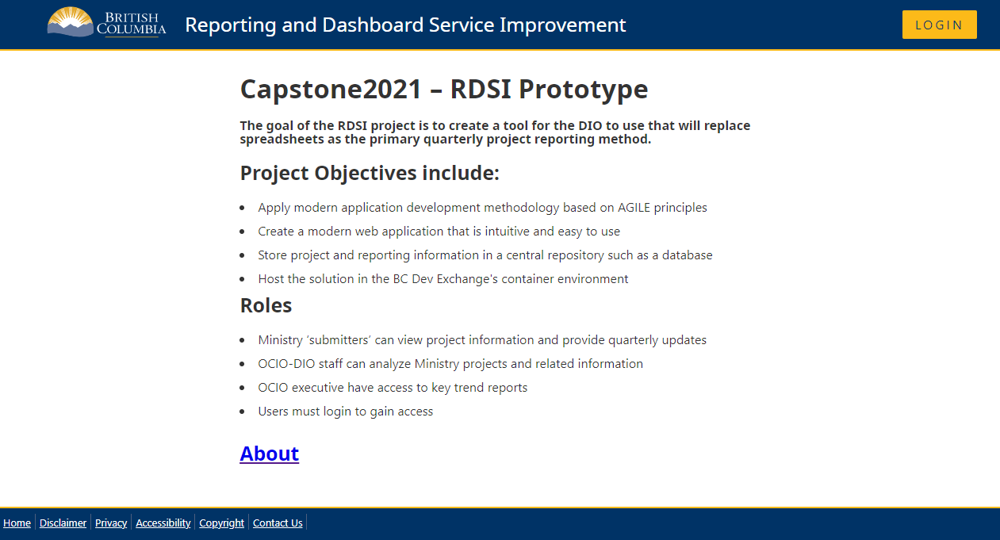

User selects the yellow **Login** button in the top right corner of the screen to navigate to the sign in view.

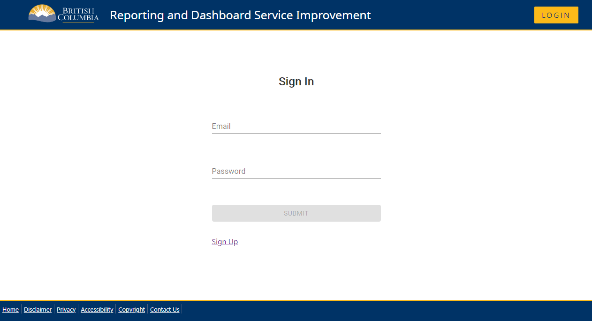

User enters email and password into fields.

User selects **Submit** to send login information to API to validate login process.

If a user successfully logs in, then they are redirected to their dashboard. Otherwise they remain on the sign in view.

---

## Register New User

**Who:** Submitter, Finance Analyst, Data Analyst, & Executive
**When:** A user is not registered in the system

To register a new user with the application, first navigate to the login screen by selecting the **Login** button in the top right corner of the screen.

Click the **Sign Up** link below the login form to navigate to the sign up form for new users.

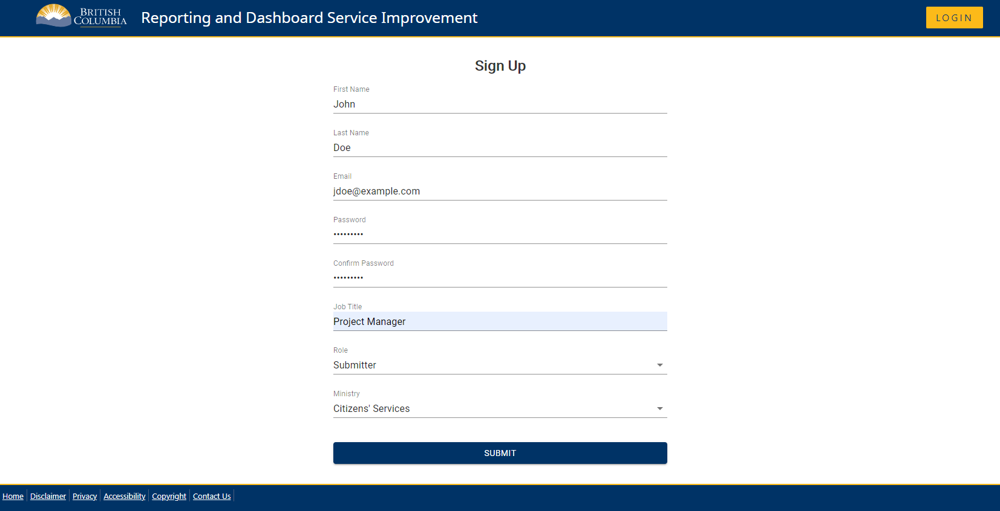

Enter relevant user information.

Each field in the form must be validated before the user information is submitted to register a new user:
- **First Name** and **Last Name** fields must be alphanumeric and each be between 1 and 50 characters long.
- **Email** is required and must be a valid email address.
- **Password** is required must contain at least 8 characters, one uppercase character, one number and one special character. Both passwords must match.
- **Job Title** is required and must be alphanumeric and be between 1 and 50 characters long.
- **Role** is required and the user must select either Admin, Submitter, Finance Analyst, Executive, or User roles. The default role is User.
- **Ministry** is required and the user must select from a list of BC Government ministries.

Once all fields are filled out and pass validation, select **Submit** to register the new user in the application.

---

## Create a New Project

> **Who:** Submitter
>
> **When:** An approved project is not registered in the system.
>
> **Assumptions:**
> - Submitter has required information available when filling out form.
> - Milestones, business case objectives, and key performance indicators have been defined and approved in the project approval process.

When a project is approved for funding by the DIO it can then be entered into the application for quarterly status reporting. This helps reduce manual effort seen in the original reporting process by having the Submitter enter project information and contacts once instead of every report.

When a Submitter logs into the application, they are presented with a list of projects that exist in the system.

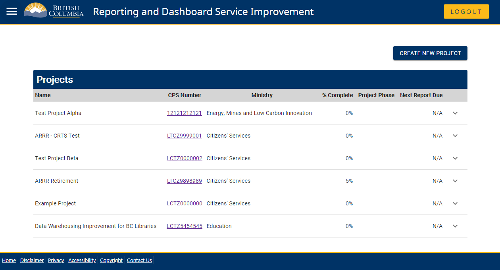

Select the **Create New Project** button above the project list table to begin entering a new project into the application.

> The new project form is a multi-step form where fields are grouped by type. Each step must be completed and validated before the user can move to the next step. 

### Step 1: Project Identification

The first step involves the project identification information such as the name of the project, a description, the ministry responsible, the program name, the CPS identifier, and a ministry project number.

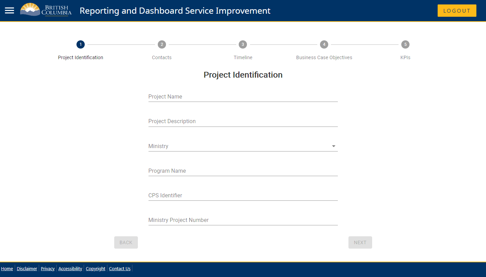

Fill out the project information at this step.

> All fields must be validated before the user can continue:
> - **Project Name** is required, must be alphanumeric, and must be between 1 and 50 characters in length.
> - **Project Description** must be text and not exceed 400 characters in length.
> - **Ministry** is required and user must select from a list of BC Government ministries.
> - **CPS Identifier** is required, must be alphanumeric, and must be between 1 and, and must be 11 characters long.
> - **Ministry Project Number** is required, must be alphanumeric, and must be between 2 and 10 characters in length.

Select the **Next** button once all fields are filled out and validated.

### Step 2: Project Contacts

The second step involves selecting the contacts for the project. Smaller projects may have one user, usually the project manager, listed multiple times.

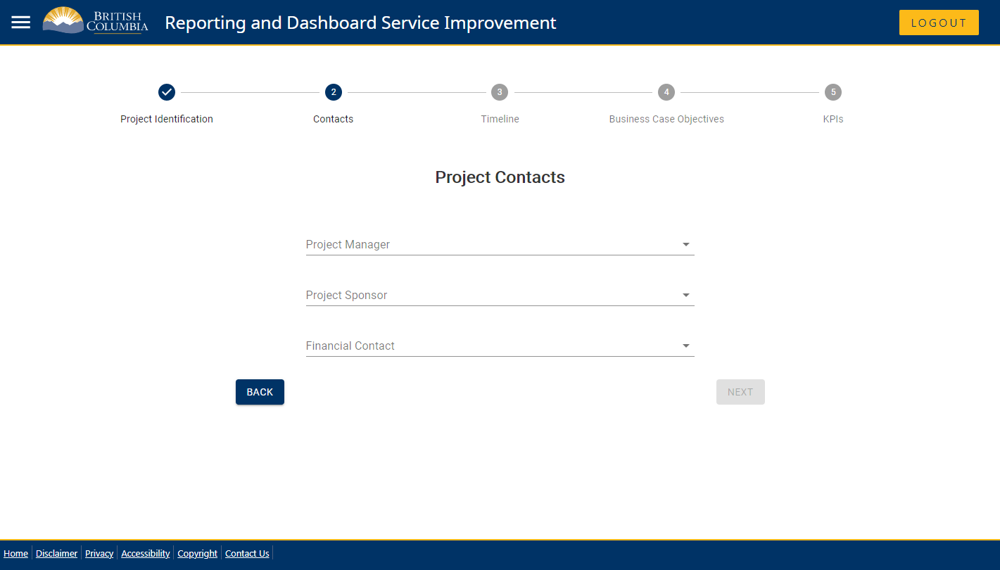

Enter the project contacts here.

> All fields must be filled out before the user continues and duplicate contacts are allowed:
> - **Project Manager** is the primary Submitter for the project and must be an existing user.
> - **Project Sponsor** must be an existing user.
> - **Project Manager** must be an existing user.

Select the **Next** button once all fields are filled out and validated.

### Step 3: Project Timeline Information

The third step is where the start and estimated completion dates of a project are entered. Here the user can also add the key milestones for the project. The start date and estimated date of completion must be entered before the user can continue to the next step, but the application does not require milestones to be added at this step.

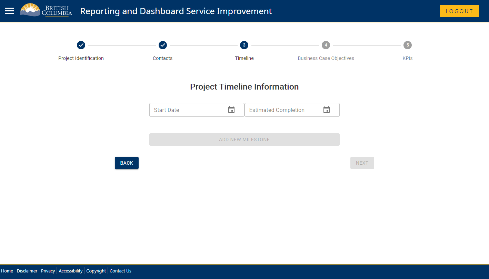

>Both **Start Date** and **Estimated Completion** must be valid dates. Date picker elements are used to enforce this.

Enter the project's start date and estimated date of completion.

#### Add a Milestone

The number of milestones a project has can vary in length and not all projects have milestones. To support this, milestones must be created one at a time and then added to the project.

First, select the **Add New Milestone** button to bring up the **Create New Milestone** form.

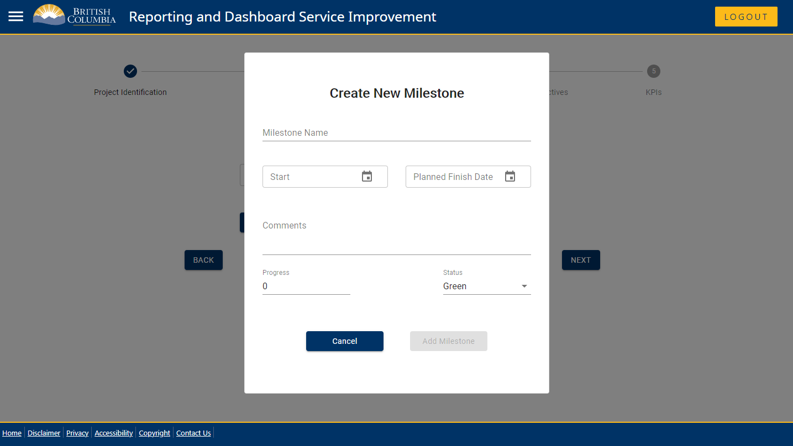

Fill out the form with milestone information.

> Not all fields must be filled out, but all fields must be validated before a new milestone can be added to the project:
> - **Milestone Name** is required, must be alphanumeric, and must be between 1 and 50 characters in length.
> - **Start** is required and must be a valid date. A date picker element is used to enforce this.
> - **Planned Finish Date** is required and must be a valid date. A date picker element is used to enforce this.
> - **Comments** is only required if the status is *Yellow* or *Red*, must be text, and must not exceed 400 characters in length.
> - **Progress** is required and must be a number between 0 and 100; the default is 0.
> - **Status** is required and the user must select one of the options from the status dropdown; default is *Green*.

Select the **Add Milestone** button when it becomes enabled after all fields are validated to add a milestone to the project.

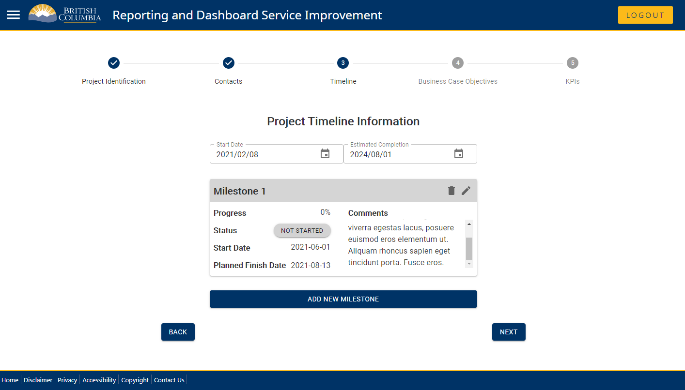

Confirm a card for the milestone appears in the view and contains information entered.

Repeat for each milestone.

Select the **Next** button once this step passes validation and all of the project's milestones are entered.

#### Edit a Milestone

Milestones can be edited when creating a project and after a project is created.

Select the **Pencil Icon** on the card of the milestone you wish to edit to bring up the **Edit Milestone** form.

This form is similar to the **Create New Milestone** form but will be populated with the milestone's information.

Edit the field or fields you wish to update.

Select **Update** when the fields are updated to your satisfaction.

> :warning: If a field is updated to be no longer valid, the **Update** button will be disabled.

#### Delete a Milestone

Milestones can only be deleted when creating a project.

Select the **Trashcan Icon** on the card of the milestone you wish to delete.

The milestone will then be deleted and no longer display in the view.

### Step 4: Business Case Objectives

The fourth step is where business case objectives are added. These objectives must be entered individually similar to how milestones are entered.

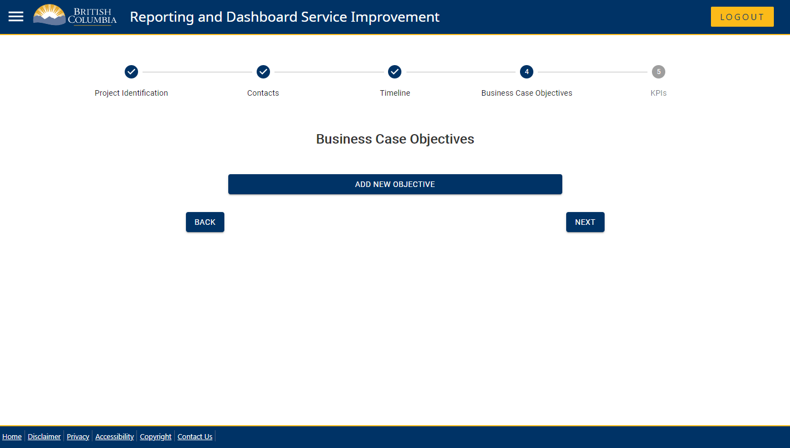

#### Add a Business Case Objective

First, select the **Add New Objective** button to bring up the **Create New Objective** form.

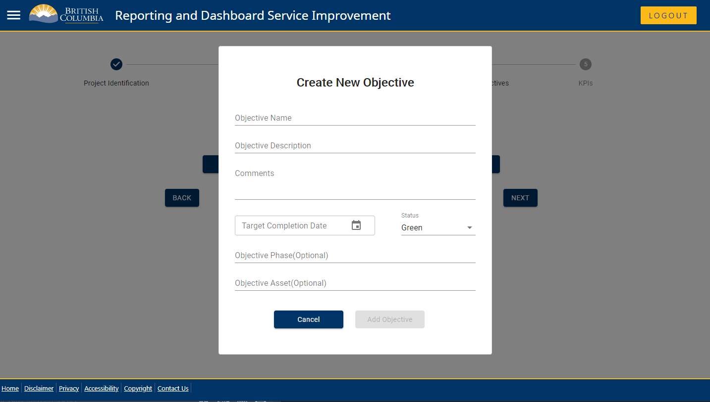

Fill out the form with the objective information.

> Not all fields must be filled out, but all fields must be validated before a new objective can be added to the project:
> - **Objective Name** is required, must be alphanumeric, and must be between 1 and 50 characters in length.
> - **Objective Description** is optional, but must be text and not exceed 400 characters in length.
> - **Comments** is required if the status is *Yellow* or *Red*, must be text, and must not exceed 400 characters in length.
> - **Target Completion Date** is required and must be a valid date. A date picker element is used to enforce this.
> - **Status** is required and the user must select one of the options from the status dropdown; default is *Green*.
> - **Objective Phase** is optional, but must be alphanumeric, and must be between 1 and 50 characters in length.
> - **Objective Asset** is optional, but must be alphanumeric, and must be between 1 and 50 characters in length.

Select the **Add Objective** button when it becomes enabled after all fields are validated to add a objective to the project.

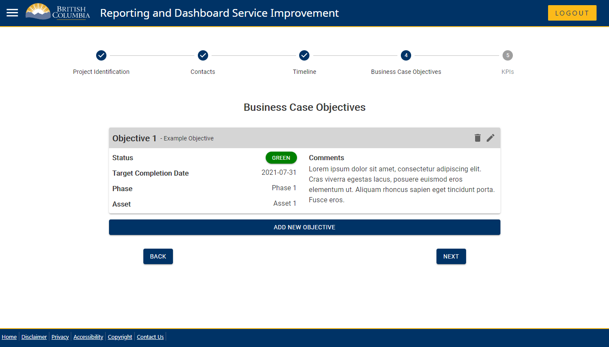

Confirm a card for the objective appears in the view and contains information entered.

Repeat for each objective.

Select the **Next** button once all of the project's objectives are entered.

#### Edit a Business Case Objective

Objectives can be edited when creating a project and after a project is created.

Select the **Pencil Icon** on the card of the objective you wish to edit to bring up the **Edit Objective** form.

This form is similar to the **Create New Objective** form but will be populated with the objective's information.

Edit the field or fields you wish to update.

Select **Update** when the fields are updated to your satisfaction.

> :warning: If a field is updated to be no longer valid, the **Update** button will be disabled.

#### Delete a Business Case Objective

Objectives can only be deleted when creating a project.

Select the **Trashcan Icon** on the card of the objective you wish to delete.

The objective will then be deleted and no longer display in the view.

### Step 5: Key Performance Indicators

The fifth and final step is where key performance indicators, or KPIs, are added. KPIs must be entered individually similar to how milestones and objectives are entered.

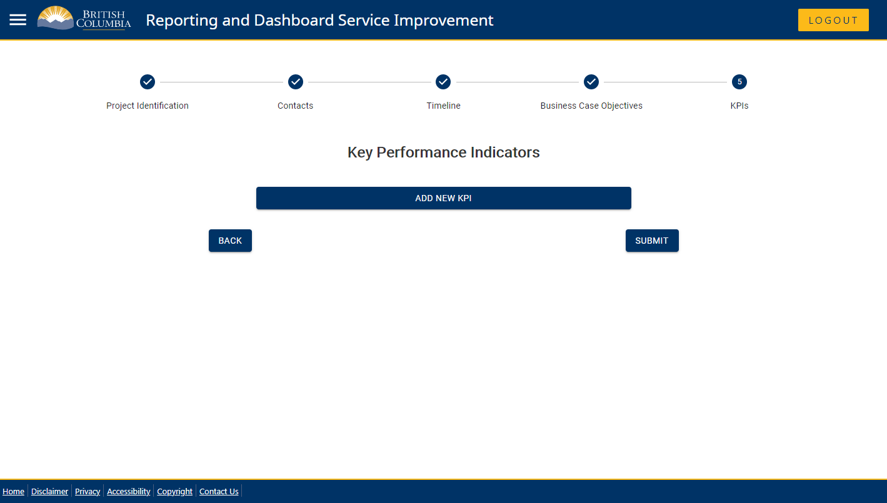

#### Add a New Key Performance Indicator

First, select the **Add New KPI** button to bring up the **Create Key Performance Indicator** form.

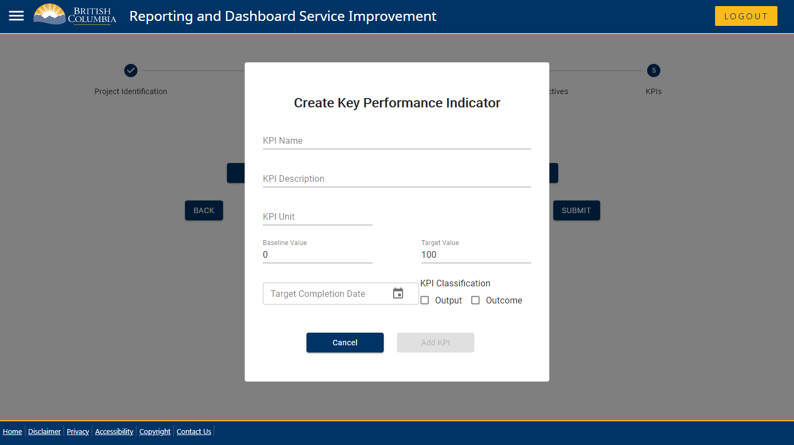

Fill out the form with the KPI information.

> Not all fields must be filled out, but all fields must be validated before a new objective can be added to the project:
> - **KPI Name** is required, must be alphanumeric, and must be between 1 and 50 characters in length.
> - **KPI Description** is optional, but must be text and not exceed 400 characters in length.
> - **KPI Unit** is required and must be alphanumeric.
> - **Baseline Value** is required and must be a number.
> - **Target Value** is required and must be a number.
> - **Target Completion Date** is required and must be a valid date. A date picker element is used to enforce this.
> - **KPI Classification** is not required, but either **Output**, **Outcome** or both should be selected depending on the KPI type.

Select the **Add KPI** button when it becomes enabled after all fields are validated to add a KPI to the project.

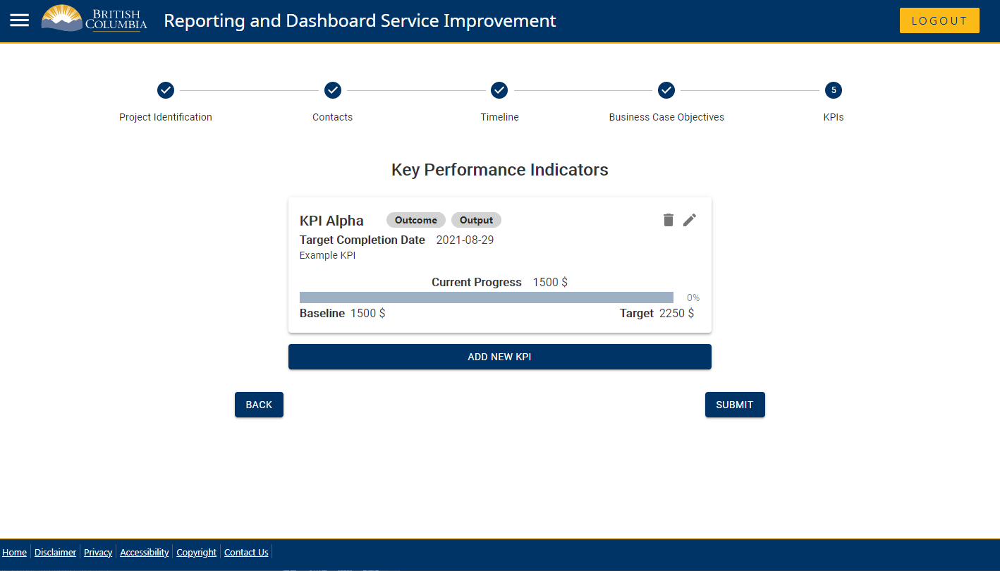

Confirm a card for the KPI appears in the view and contains information entered.

Repeat for each KPI.

Select the **Submit** button once all of the project's KPIs are entered. This will transmit the project data and create a new project in the application.

> :warning: Milestones, Business Case Objectives, and Key Performance Indicators cannot be deleted after this step. Ensure they are correct before submitting form.

#### Edit a Key Performance Indicator

KPIs can be edited when creating a project and after a project is created.

Select the **Pencil Icon** on the card of the KPI you wish to edit to bring up the **Edit Key Performance Indicator** form.

This form is similar to the **Create Key Performance Indicator** form but will be populated with the KPI's information.

Edit the field or fields you wish to update.

Select **Update** when the fields are updated to your satisfaction.

> :warning: If a field is updated to be no longer valid, the **Update** button will be disabled.

#### Delete a Key Performance Indicator

KPIs can only be deleted when creating a project.

Select the **Trashcan Icon** on the card of the KPI you wish to delete.

The KPI will then be deleted and no longer display in the view.

---

## Complete a Quarterly Report

**Who:** Submitter
**When:** A project exists and must be reported on for current quarter.
**Assumptions:**
- A project exists that the Submitter wishes to report on.

Once a project is entered into the application, Submitters can then complete and submit quarterly reports for that project. For this POC prototype users can submit any number of reports for a project at any time they wish. However, a production ready application will allow the DIO to set windows for reporting periods.

From the project list, select the arrow icon on the project you wish to report on to expand the details.

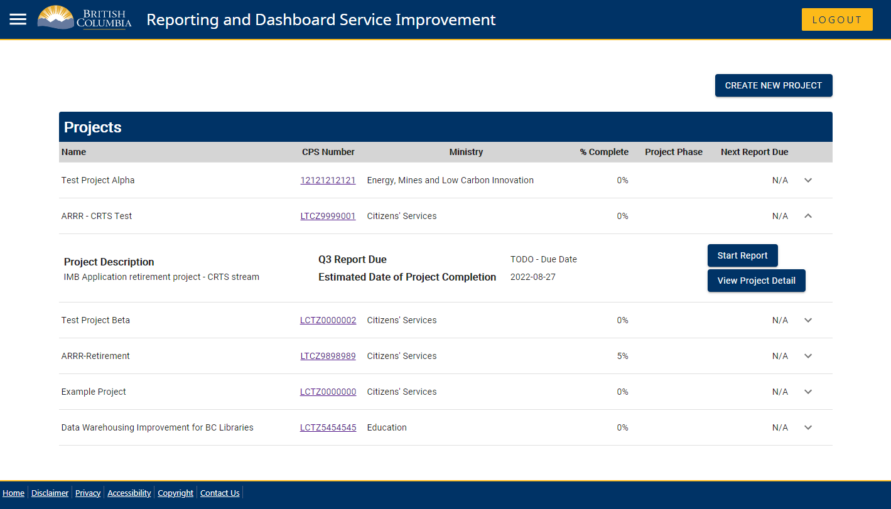

Select the **Start Report** button to begin the process of completing a quarterly status report.

> The quarterly report form is a multi-step form where fields are grouped by type. Steps 2-6 can be completed in any order, but the first step where the user confirms the project information cannot be skipped. 

### Step 1: Project Information

The first step is where the user confirms that they are reporting on the correct project and that the information for that project is accurate and up to date.

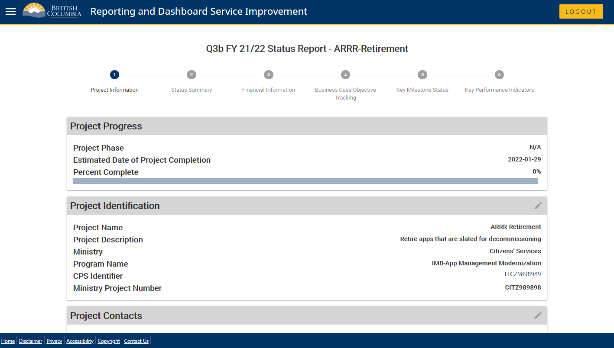

Inspect the information visually and confirm that it is accurate and up to date.

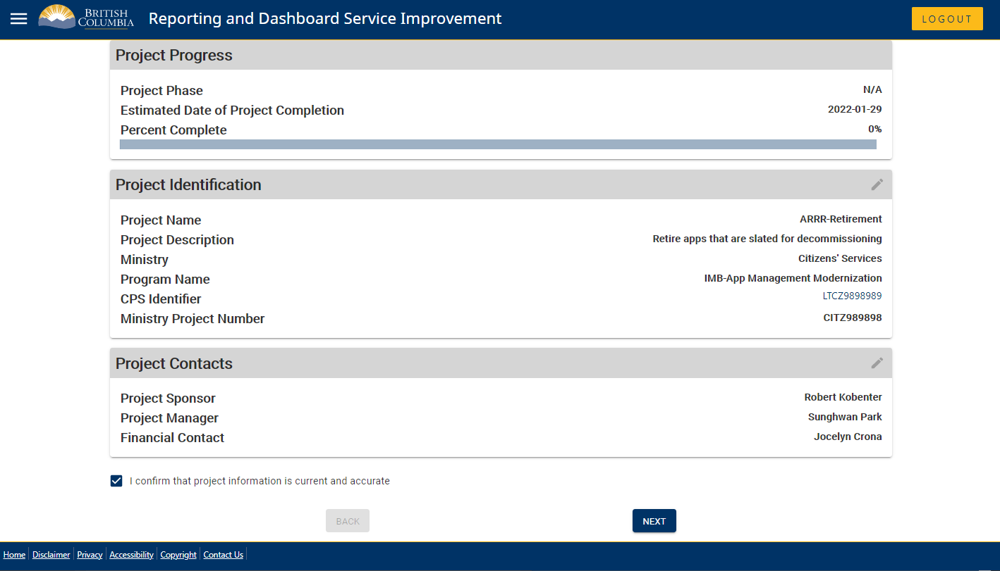

Select the confirmation checkbox if information is current and accurate.

Select the **Next** button to continue to the next step.

> Alternatively, select a number from the stepper at the top of the form to navigate to that step directly.

### Step 2: Status Summary

The status summary provides an overview of a project's health based on the Submitter's understanding of the project. There is an **Overall Project Status** status as well as **Scope**, **Budget**, **Schedule**, and **Other Issues or Risks** statuses. Comments are welcome but not required unless a status is *Yellow*, *Red*, or trending down.

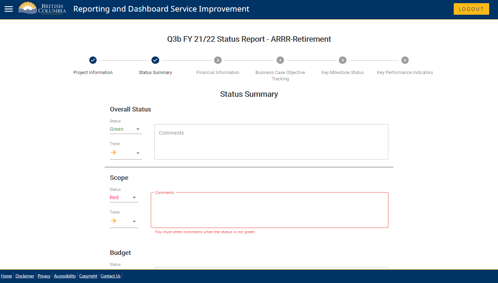

Update the statuses based on your project's performance using the following definitions:

> **Scope**
> - Green: No projected material changes to scope baseline.
> - Yellow: Minor changes to scope which will impact benefits OR budget OR extend the scheduled project delivery.
> - Red: Changes in project are significant - greater than 20% of scope (change in solution, change in scope of solution, change in benefits from solution). 

> **Budget**
> - Green: No projected material changes to budget baseline.
> - Yellow: Project cannot be delivered as planned without an increase of 5-15% (please specify cause of increase); OR project cannot spend current year budget (i.e. delays - please specify cause of delays).
> - Red: Project cannot be delivered as planned without an increase of more than 15%. 

> **Time**
> - Green: No projected material changes to schedule.
> - Yellow: Project schedule will be extended/delayed to include one (or more)  fiscal year/s and impacts capital budget - request to re-profile.
> - Red: Project schedule will be extended/delayed to include one or more fiscal years, AND impact government commitments.

> **Risk**
> - Green: No projected  risks which will impact scope, benefits, budget, or timeline.
> - Yellow: Significant projected risks (resources, political factors, external or internal impacts, etc.) which may impact scope, benefits, budget, and/or timeline.
> - Red: Sector governance in place to re-structure and prioritize strategic benefit of project.

> **Overall Status** should be representative of the project as a whole and not conflict with the information entered in the other statuses.

Select the **Next** button once all statuses have been updated to advance to the next step.

### Step 3: Financial Information

The financial information for a project is entered at this step. Submitters report on the finances for the current fiscal year and the overall project.

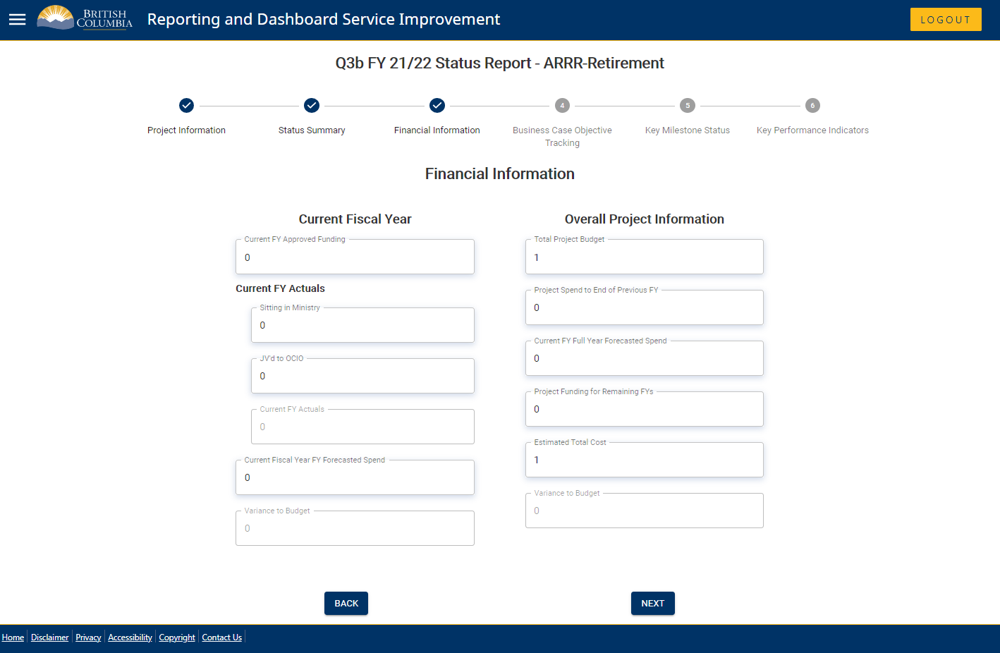

Enter the financial information for the current fiscal year into the form.

> All fields must be valid before proceeding to other steps and some fields are automatically calculated from other fields:
> - **Current FY Approved Funding** must be entered by the user and be a number.
> - **Current FY Actuals** is a precalculated number that is the sum of *Sitting in Ministry* and *JV'd to OCIO*.
> - **Sitting in Ministry** must be entered by the user and be a number.
> - **JV'd to OCIO** must be entered by the user and be a number.
> - **Current FY Full Year Forecasted Spend** must be entered by the user and be a number. This field appears in both *Current Fiscal Year* and *Overall Project Information* sections but has one value; updating one field will update the other.
> - **Variance to Budget** is a precalculated number that is the difference between *Current FY Approved Funding* and *Current FY Full Year Forecasted Spend*.

Enter the financial information for the overall project into the form.

> All fields must be valid before proceeding to other steps and some fields are automatically calculated from other fields:
> - **Total Project Budget** must be entered by the user and be a number.
> - **Project Spend to End of Previous FY** must be entered by the user and be a number.
> - **Current FY Full Year Forecasted Spend** must be entered by the user and be a number. This field appears in both *Current Fiscal Year* and *Overall Project Information* sections but has one value; updating one field will update the other.
> - **Project Funding for Remaining FYs** must be entered by the user and be a number.
> - **Estimated Total Cost** must be entered by the user and be a number.
> - **Variance to Budget** is a precalculated number that is the difference between *Total Project Budget* and *Estimated Total Cost*.

Select the **Next** button once financial information is entered to proceed to the next step.

### Step 4: Business Case Objective Tracking

Business case objectives are reported on at this step. A project's objectives are displayed where the Submitter can update the status, target completion date, and add comments to provide context.

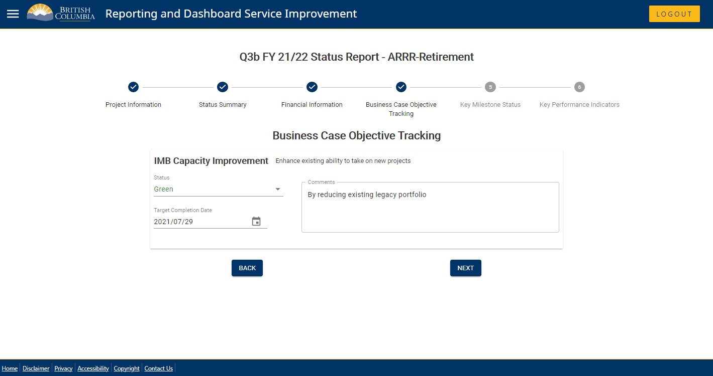

Update an objective's status by selecting a status from the **Status** dropdown.

Update the **Comments** to provide context that may be needed for that objective. 
> Comments are required if a status is Yellow or Red.

Update the **Target Completion Date** if required.

> :warning: While the system currently allows a Submitter to change the target completion date, future iterations should either disallow this or alert reviewers of this change.

Repeat for each objective.

Select the **Next** button once all objectives are updated to proceed to the next step.

### Step 5: Key Milestone Status

Key milestones are reported on at this step. A project's milestones are displayed where the Submitter can update the status, progress, start date, planned finish date, and add comments to provide context.

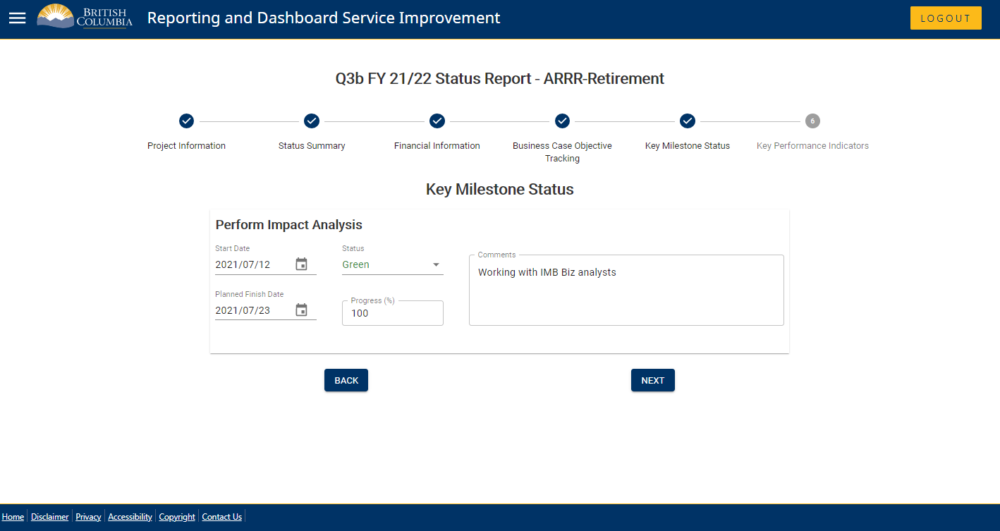

Update a milestone's status by selecting a status from the **Status** dropdown.

Update the milestone's progress in the **Progress** field.

Update the **Comments** to provide context that may be needed for that objective. 
> Comments are required if a status is Yellow or Red.

Update the **Start Date** and **Planned Finish Date** if required.

> :warning: While the system currently allows a Submitter to change the target completion date, future iterations should either disallow this or alert reviewers of this change.

Repeat for each milestone.

Select the **Next** button once all milestones are updated to proceed to the next step.

### Step 6: Key Performance Indicators

KPIs are reported on at this step. A project's KPIs are displayed where the Submitter can update the progress of that KPI.

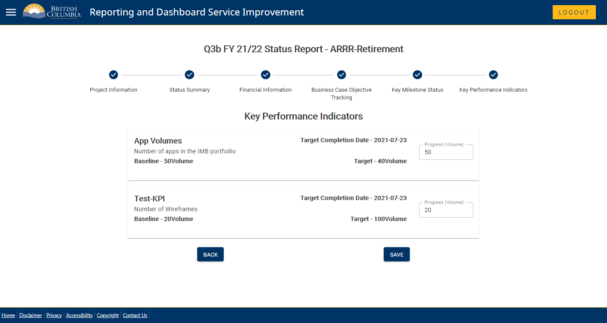

Update a KPI's progress in the **Progress** field.

Repeat for each KPI.

Select the **Save** button once all KPIs are updated to proceed to a view of the report details.

### DIO Submission

Review the report information with relevant team members and stakeholders.

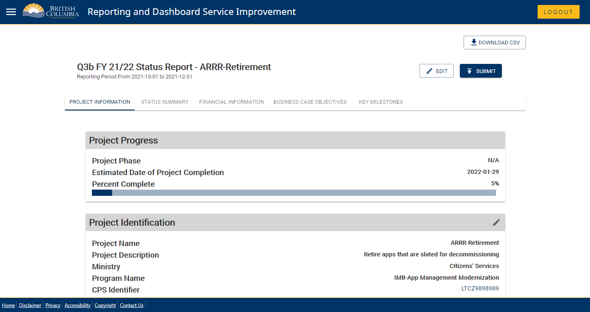

Select the **Edit** button above the report tabs to make changes. This will return the user to the report form where they can make changes.

Select the **Submit** button once report information has been reviewed and verified to submit a report to the DIO for review.

> The *Edit* and *Submit* buttons will then be replaced by a message stating who submitted the report and the date of submission.

---

## Review a Quarterly Report

**Who:** Finance Analyst
**When:** A Submitter completes and submits a quarterly status report to the DIO.

